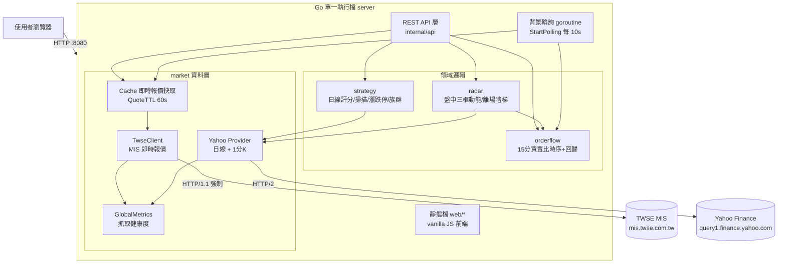
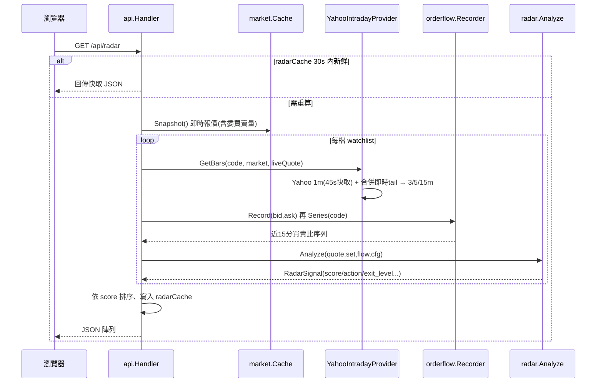
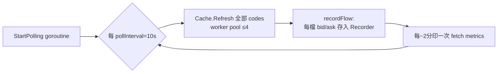

# Stock Radar — Project Master Plan

> **文件目的**：讓一位完全沒有上下文的資深工程師，只讀這份文件就能接手本專案。
> **文件來源**：本文件由實際原始碼（`internal/`、`cmd/`、`web/`、`stocks.yaml`、`README.md`）逐檔萃取，
> 而非依賴任何對話記憶；因此可作為「失憶後」的權威交接基準。凡程式碼與 README 有出入，皆列入 [Known Issues](#known-issues)。
> **最後校對日**：2026-06-10（對應 commit `9d886e9`）

---

# Executive Summary

**Stock Radar** 是一套**個人用、單機、即時**的台灣股市（上市 TSE / 上櫃 TPEX）技術分析工具。
它把「即時報價 + 盤中多時間框 K 線 + 委買賣單流 + 歷史日線指標」整合進一個 Go 編譯出來的單一執行檔，
對外提供 REST API 與一個純靜態（vanilla JS）的網頁前端，**自動計算評分並直接給出中文交易建議**。

### 為什麼要做這個專案（動機）

一般看盤軟體只丟一堆數字（MA、KD、RSID、量），要使用者自己腦補成決策。本專案的核心理念是
**「不要秀數字，直接回答決策」**，並針對台股當沖最常見的陷阱（「3 分線看多、15 分線其實在跌」的假突破）
做了結構性防呆。系統圍繞兩種完全不同的交易尺度設計：

| 工具 | 定位 | 時間尺度 | 回答的問題 |
|---|---|---|---|
| **Radar（當沖）** | 盤中當沖、動能交易 | 3 / 5 / 15 分鐘 | 今天能不能做？方向對不對？是不是突破點？主力進場沒？該出了嗎？ |
| **Scanner（掃描器）** | 波段選股（1～4 週） | 日線 | 未來幾週有沒有機會？現在是剛起漲還是末升段？ |

輔以兩個頁面：**Portfolio（持倉管理）** 與 **Watchlist（自選股）**。

### 設計哲學（最重要的一句，整個 radar package 圍繞它）

```
有量進  →  量縮觀察  →  量縮 + 買盤退 = 出  →  趨勢翻空 = 強制出
```

對強勢股，**量縮代表上攻動能不足，應優先視為「獲利了結」訊號，而非停損**。因此離場不是單一停損價，
而是**四級漸進階梯**（見 [Current Implementation](#current-implementation)）。

---

# Architecture

## 系統脈絡（C4-ish Context）



## 資料流（Radar 一次請求）



## 背景輪詢（驅動買賣比時序）



---

# Requirements

## 功能需求（Functional）

1. **即時報價**：對 watchlist + positions 全部代號抓 TWSE MIS 即時報價（價、量、開高低、前五檔委買賣總量）。
2. **Radar 當沖分析**（`/api/radar`）：3/5/15 分三框趨勢、三框量比、近 15 分買賣比趨勢、動能狀態、
   可否進場 / 回測買點 / 四級離場階梯、0–100 動能評分、中文理由。
3. **Scanner 波段掃描**（`/api/scanner`）：MA20/60/120 排列、60/120 日新高、突破整理、量能擴張、
   相對強度 RS、Weinstein 五階段、台股漲跌停 / 連板 / 開板 / 處置注意股分析、族群資金流入流出排名，依分數排序。
4. **Portfolio 持倉**（`/api/positions`）：成本/現價/損益%、停損價（兩法取較緊）、目標一/二、風報比、
   日線建議 Action + 中文建議，並疊加 Radar 盤中離場階梯。
5. **Watchlist 自選**（`/api/stocks`）：日線 MA5/MA20/RSI/KDJ/量比 + 評分 + Action。
6. **單股完整分析**（`/api/analyze?code=`）。
7. **抓取健康度**（`/api/metrics`）：requests / success_rate / eof / retries / avg_response_ms。
8. **設定檔驅動**：所有股票清單、閾值、連線參數集中在 `stocks.yaml`。
9. **連線診斷工具** `cmd/twse-diag`：以矩陣 A–G 證明「MIS 會 reset HTTP/2、改 HTTP/1.1 全解」。

## 非功能需求（Non-Functional）

- **韌性**：上游（MIS / Yahoo）抖動時不可崩、不可清空畫面——失敗時回傳「最後一筆好資料」（last-good）。
- **啟動不阻塞**：開機立即 listen，報價於背景填入（避免 MIS 全掛時開機卡數十秒）。
- **抓取節制**：低併發（≤3–4）、HTTP/1.1、瀏覽器標頭、退避 + jitter、per-code single-flight，避免觸發 MIS reset / EOF。
- **快取分層**：報價 60s、Radar 回應 30s、Scanner 回應 30min、日線 4h、Yahoo 1m 原始 45s。
- **時區無依賴**：用固定 `CST = UTC+8` zone，不依賴 host tzdata。
- **單機可跑**：`make run` 即起，無資料庫、無外部相依服務。

---

# Design Decisions

## 為何採用目前方案

| 決策 | 選擇 | 理由 |
|---|---|---|
| **語言/形態** | Go，單一靜態 binary + 內嵌 HTTP server | 單機個人工具，零部署摩擦；goroutine 適合背景輪詢 + 並發抓取 |
| **前端** | 原生 vanilla JS（`web/app.js` 約 719 行），無框架/無建置 | 個人工具不需要工具鏈；`http.FileServer` 直接服務 |
| **即時報價來源** | TWSE MIS `getStockInfo.jsp` | 官方即時來源，含前五檔委買賣（買賣比的唯一資料源） |
| **MIS 強制 HTTP/1.1** | `force_http1: true`（預設） | **核心發現**：MIS 會 reset HTTP/2；`cmd/twse-diag` 矩陣實測 h2 全 reset、h1 全成功。**併發/間隔/cookie/keep-alive 都無關，只有 HTTP 版本有差** |
| **歷史 + 盤中 K 來源** | Yahoo Finance chart API | 免費、含 1m 盤中與日線；對 h2 正常（只遇過 429），故預設 HTTP/2 |
| **盤中最新一分鐘** | Yahoo 1m + 即時 MIS tail 合併 | Yahoo 1m 落後約一分鐘；用 MIS 即時價覆蓋「當前分鐘」K，價格永遠精確 |
| **買賣比看趨勢非快照** | 近 15 分序列 + 最小二乘回歸斜率 | 單一快照（買一掛很多）易被假象騙；用整個窗口回歸抗單點雜訊 |
| **離場用四級階梯** | 量縮=獲利了結 alert，趨勢翻空才強制出 | 動能交易哲學：強勢股量縮是動能不足非破底，過早停損會被洗掉 |
| **BUY 閘門** | `15分多 ∧ 5分多 ∧ 3分突破` 三者齊備才放行 BUY | 擋掉「3 分單獨爆量、大框其實向下」的假突破——本工具最核心的防呆 |
| **韌性策略** | last-good cache + single-flight + 背景輪詢 | 抓取失敗也維持畫面；重複請求收斂成一次 |
| **抓取健康度** | `GlobalMetrics` 全域 sink，所有 httpGet 匯入 | 不改資料源就能診斷 EOF / 限流 |

## 被淘汰 / 試過但否決的方案（由 `cmd/twse-diag` 矩陣與程式碼註解推斷）

- **HTTP/2 連 MIS**：A/B/C/D/F 情境全 reset（0% 成功）→ 淘汰，改強制 HTTP/1.1（E/G 100%）。
- **靠 session cookie（先 GET index.jsp）解 reset**：情境 F 仍 reset → 否決，非 cookie 問題。
- **靠關 keep-alive / 降併發解 reset**：有幫助但非根因，單獨不可靠 → 保留為次要旋鈕（`disable_keepalive`），不作主解。
- **單一停損價模型**：與動能交易哲學衝突 → 改四級離場階梯；`stop_ref`（近 6 根 5 分 K 低點）僅作「參考防線」非固定停損。
- **Yahoo 抓不到就切市場（auto-detect）對 transient 也切**：會抓錯市場 → 改為**只有 HTTP 404 / 空結果（`errSymbolNotFound`）才探另一個市場**，429/timeout/5xx 一律保留原市場稍後重試。

---

# Current Implementation

## 已完成功能（依 milestone 分組；M 編號為本文件歸納，非 git tag）

### M1 — 即時報價與抓取韌性層（market package）✅

- `TwseClient`（`twseclient.go`）：MIS 即時報價客戶端，含
  - 全域 semaphore 併發上限、per-code single-flight、only-transient 重試（reset/eof/timeout）+ 指數退避 300/700/1500ms + jitter ≤300ms。
  - last-good：抓取失敗回傳上一筆好報價，cache 永不清空。
  - 市場解析：hint（tse/otc）優先；無 hint 時 tse→otc，但**只有「definitively not on market」才探 otc**。
  - 每次 attempt 結構化 log（code/market/attempt/latency/type）。
- `Cache`（`cache.go`）：worker pool（`maxWorkers=4`）刷新、`refreshing` 旗標避免重入、`QuoteTTL=60s`、`IsEmpty/IsStale`。
- `GlobalMetrics`（`metrics.go`）：requests/successes/eof/retries/avgMs。
- `buildHTTPClient` / `httpGet`（`twse.go` / `fetch.go`，未逐一展開）：HTTP/1.1 切換、自我 jitter、metrics 記錄。

### M2 — 歷史與盤中 K 線（market package）✅

- `YahooHistoryProvider`（`history.go`）：日線 candles，4h handler 層快取。
- `YahooIntradayProvider`（`intraday.go`）：
  - Yahoo `interval=1m&range=1d` 抓 1 分 K，`rawTTL=45s` 快取。
  - `mergeLiveTail`：把即時 MIS 報價折入「當前分鐘」（價格精確、量為估計：MIS 日累積量×1000 − Yahoo 已計量，clamp≥0）。
  - `aggregate`：對齊 09:00 session 邊界聚合成 3/5/15m。
  - `marketOpenNow`：週一～五 09:00–13:30 才套即時 tail，否則 `Closed=true`（資料為 Yahoo 純歷史）。
- `YahooSymbol(code, market)`：`TW→.TW`、`TWO→.TWO`，空白自動偵測並快取。

### M3 — 買賣單流時序分析（orderflow package）✅

- `Recorder`（`recorder.go`）：per-code 滾動 15 分窗口快照（bid/ask/ratio），concurrency-safe，逐 poll 餵入。
- `Analyze` / `Flow`（`trend.go`）：對 (分鐘, 買賣比) 做最小二乘回歸取斜率；`slopeThreshold=0.05/min`、`minSamples=3`，
  輸出 `增強 / 持平 / 衰退` + 原始 series（給前端 sparkline）。

### M4 — 日線評分與持倉策略（strategy package）✅

- `Analyze`（`signal.go`）：watchlist 日線評分（MA5/20/60、KDJ、RSI、盤中位置、量能），輸出 STRONG BUY/BUY/WATCH/WAIT。
- `AnalyzePosition`：持倉建議（SELL>STOP LOSS>TAKE PROFIT>REDUCE>STRONG BUY>HOLD），
  停損取「成本×95%」與「MA20×99.5%」較緊者，目標一/二 = 成本 + Risk×1.5 / ×3.0，附中文 `Advice`。
- 指標：`ma.go`（MA/MASlope/HighN/PriceChangePct/ATRPct）、`kdj.go`、`volume.go`（量能型態：價漲量增…等）。

### M5 — 波段掃描器（strategy package）✅

- `ScannerAnalyze`（`scanner.go`）：MA120/60/20 站上、MA 斜率、60/120 日新高、突破整理、量能擴張、
  RS（個股 40 日報酬 ÷ 自選平均）、MA60 乖離過大扣分、Weinstein 五階段（`calcStage`）、建議持有天數。
- `AnalyzeLimits`（`limit.go`）：台股漲跌停（±9.5%）、近 5/10 日連板數、開板分類（爆量/強勢/正常）、
  連跌警示（AVOID）、漲停後縮量整理（第二波候選）、處置/注意股（`ParseRegulation` 含解除倒數）。
- `sector.go`：硬編碼 `sectorMap`（代號→族群），`RankSectors` 算族群均分與資金流入/持平/流出。

### M6 — Radar 盤中動能模型（radar package）✅

- `Analyze`（`radar.go`）：三框趨勢（`trendOf` MA5 vs MA20）、3 分突破（爆量≥2x + 破近高）、三框量比、
  主流股/短線炒作分類、回測買點偵測（`detectPullback`）、量縮/買盤衰退/破 5 分支撐偵測、
  四級 `computeExitLevel`、加權評分（30/20/20/15/15）、`decideAction` 動作階梯、中文 `reasons`。

### M7 — API 與前端 ✅

- `api/handler.go`：6 個端點 + 靜態服務 + `StartPolling` 背景輪詢 + radar/scanner 回應級快取。
- `web/`：`index.html`（分頁）、`app.js`（4 個分頁渲染 + 詳情頁 + sparkline + 離場階梯視覺化）、`style.css`。
- `cmd/twse-diag/main.go`：reset 診斷矩陣工具。

### 測試狀態 ✅（`go test ./...` 全綠）

| Package | 測試 |
|---|---|
| `internal/market` | `twseclient_test.go`、`intraday_test.go`、`fetch_test.go` ✅ |
| `internal/orderflow` | `orderflow_test.go` ✅ |
| `internal/radar` | `radar_test.go` ✅ |
| `internal/strategy` | ❌ 無測試 |
| `internal/api`、`internal/config`、`cmd/*` | ❌ 無測試 |

---

# Pending Work

> 以下為**程式碼中不存在或明顯未完成**的項目（非 README 已宣稱完成者）。

- **設定檔熱重載**：README 宣稱「改 `stocks.yaml` 重新整理頁面即生效、不需重啟」，但 `main.go` 只在啟動時 `config.Load` 一次，
  `Handler` 持有該 `cfg` 副本，**無檔案監看 / 無重載**。→ 改 positions/watchlist/閾值目前**需重啟**（見 Known Issues #1）。
- **strategy / api / config 單元測試**：完全缺漏（評分與停損邏輯是金錢相關的核心，卻無測試覆蓋）。
- **歷史回測引擎**：`git log` 的「加入回測」實為 **Radar 的回測買點偵測（pullback-buy）**，
  **並非**對策略做歷史績效回測。若需要真正的 backtester（用日線跑策略算勝率/回撤），尚未實作。
- **持久化**：無資料庫，所有狀態（報價快取、買賣比時序）在記憶體，重啟即失；買賣比時序需重新累積 5–15 分。
- **認證 / 授權**：完全沒有（見 [Security](#security)）。
- **族群對照表**：`sectorMap` 為手動硬編碼（約 25 檔），新增股票不在表內一律「其他」、不納入族群排名。
- **`00632R` 之類非個股商品**（ETF/反向）：限額(±10%)、量單位、Yahoo 符號可能與一般個股不同——目前 stocks.yaml 有放但邏輯未特別處理（見 Known Issues #5）。
- **可觀測性**：metrics 僅 in-memory JSON 端點，無 Prometheus / 無告警（見 [Monitoring](#monitoring)）。
- **部署**：無 Dockerfile / 無 K8s / 無 Helm（見 [Deployment](#deployment)）。

---

# API Specification

Base URL：`http://localhost:8080`，全部為 `GET`、回應 `application/json`。靜態前端掛在 `/`。

| 端點 | 說明 | 來源 handler |
|---|---|---|
| `GET /api/radar` | 盤中三框 + 單流（Radar） | `ListRadar`（快取 30s） |
| `GET /api/scanner` | 波段掃描 + 族群排名（Scanner） | `ListScanner`（快取 30min） |
| `GET /api/stocks` | 自選股日線（Watchlist） | `ListStocks` |
| `GET /api/positions` | 持倉分析（Portfolio） | `ListPositions` |
| `GET /api/analyze?code=2330` | 單股完整分析 | `AnalyzeStock` |
| `GET /api/metrics` | 抓取健康度 | `Metrics` |

### `GET /api/radar`

**Request**：無參數（掃整份 watchlist）。
**Response**：`[]RadarSignal`，依 `score` 由高到低。

```json
[{
  "code": "2337", "name": "旺宏", "price": 173.0,
  "trend_15m": "Bullish", "trend_5m": "Bullish", "trend_3m": "Breakout",
  "volume_15m": 2.5, "volume_5m": 2.8, "volume_3m": 3.5,
  "flow": {
    "ratio": 3.1, "ratio_slope": 0.13, "trend": "增強", "samples": 12,
    "series": [{ "t": "2026-06-03T09:00:00+08:00", "bid_vol": 1200, "ask_vol": 1000, "ratio": 1.2 }]
  },
  "momentum": "STRONG", "can_buy": true, "pullback_buy": false,
  "volume_fade": false, "buy_flow_weakening": false, "break_5m_support": false,
  "momentum_fading": false, "exit_level": 0, "should_exit": false,
  "stop_ref": 170.5, "score": 92, "action": "STRONG BUY",
  "main_force": "主流股", "closed": false,
  "reasons": ["15分偏多（方向）", "5分偏多（進場）", "3分突破（點火）", "買盤增強（買賣比 3.10）"]
}]
```

語意：`momentum` ∈ {STRONG,RISING,FADING,DEAD,NEUTRAL}；`exit_level` 0–4 對應四級階梯；
`should_exit` = Level≥3；`stop_ref` 僅參考防線（非固定停損）；`closed=true` 代表非盤中（Yahoo 純歷史）。

### `GET /api/scanner`

**Response**：`{ "stocks": []scannerRow, "sectors": []SectorScore }`，stocks 依 score 排序。
重點欄位：`stage`/`stage_zh`（Weinstein 階段）、`rs`、`is_60d_high`/`is_120d_high`、
`limit_status`/`limit_status_zh`、`limit_up_days_5`、`open_limit_type`、`is_hot`/`is_avoid`/`is_consolidating`、
`regulation`（處置/注意 + 解除倒數）、`sector_rank`/`sector_flow`。

### `GET /api/positions`

**Response**：`[]positionRow`。除日線欄位（`stop_loss`/`target1`/`target2`/`risk_reward`/`advice`/`action`）外，
內嵌 `radar`（`*RadarSignal`，盤中離場階梯，盤中才有、收盤可能為 null）。

### `GET /api/stocks`

**Response**：`[]stockRow`（`code,name,price,change,change_pct,score,action,ma5,ma20,rsi14,vol_ratio,vol_pattern,large_order,bid_ask_ratio`）。

### `GET /api/analyze?code=XXXX`

**Request**：`code`（必填，四位代號，不含後綴）。缺 code → `400`；上游全失敗且無快取 → `500`。
**Response**：單一 object（含 ma5/20/60、k/d/j、rsi14、entry/stop_loss/take_profit、reasons…）。

### `GET /api/metrics`

```json
{ "requests": 1234, "successes": 1230, "success_rate": 0.9968,
  "eof_count": 2, "retries": 5, "avg_response_ms": 142.3 }
```

---

# Data Model

> **無資料庫**。所有「資料模型」皆為記憶體中的 Go struct。以下為交接時需理解的核心型別。

## 設定（`internal/config`）

```go
type Config struct {
    RefreshSeconds int
    Strategy struct{ BuyScore, WatchScore int } // 預設 80 / 60
    TWSE  TWSEConfig   // force_http1(預設true)/max_concurrent(3)/timeout(10s)/max_retries(3)/disable_keepalive
    Yahoo YahooConfig  // force_http1(預設false)/timeout(10s)/disable_keepalive
    Positions []PositionConfig // code,name,entry,shares,market
    Watchlist []StockConfig    // code,name,market,warn,warn_start,warn_end
}
```
（`ForceHTTP1` 用 `*bool` 區分「未設定」與「設 false」。）

## 市場資料（`internal/market`）

```go
type Quote struct {
    Code, Name string
    Price, Open, High, Low float64
    Volume int64; RefPrice, Change, ChangePct float64
    BidVol, AskVol int64 // 前五檔委買/委賣總量 → 買賣比唯一來源
}
type Candle struct { Date time.Time; Open,High,Low,Close float64; Volume int64 }
type IntradaySet struct { Bars3m, Bars5m, Bars15m []Candle; Closed bool }
type MetricsSnapshot struct { Requests,Successes int64; SuccessRate float64; EOFCount,Retries int64; AvgMs float64 }
```

## 單流（`internal/orderflow`）

```go
type Snapshot struct { T time.Time; BidVol,AskVol int64; Ratio float64 }
type Flow struct { Ratio,RatioSlope float64; Trend string; Samples int; Series []Snapshot }
```

## 策略（`internal/strategy`）

`Signal`、`PositionSignal`、`ScannerSignal`、`LimitAnalysis`、`RegulationStatus`、`SectorScore`、`LimitStatus`。

## Radar（`internal/radar`）

`RadarSignal`（見 API 範例）；常數權重 `wTrend15m=30, wFlow=20, wVolume=20, wTrend5m=15, wTrigger=15`。

## 關鍵常數對照（交接時容易踩的「魔法數字」）

| 常數 | 值 | 位置 | 意義 |
|---|---|---|---|
| `QuoteTTL` | 60s | cache.go | 報價視為新鮮的上限 |
| `maxWorkers` | 4 | cache.go | 刷新併發 |
| `pollInterval` | 10s | api/handler.go | 背景輪詢間隔（買賣比取樣節奏） |
| `radarCacheTTL` | 30s | handler.go | Radar 回應快取 |
| `scannerCacheTTL` | 30min | handler.go | Scanner 回應快取 |
| `historyTTL` | 4h | handler.go | 日線快取 |
| `rawTTL` | 45s | intraday.go | Yahoo 1m 原始快取 |
| `DefaultWindow` | 15min | recorder.go | 買賣比保留窗口 |
| `slopeThreshold` | 0.05/min | trend.go | 增強/衰退判定門檻 |
| `minSamples` | 3 | trend.go | 出方向所需最少樣本 |
| `breakoutVolRatio` | 2.0 | radar.go | 3 分點火所需量比 |
| `LimitUp/DownThreshold` | ±9.5% | limit.go | 漲跌停判定 |
| session | 09:00–13:30 | intraday.go | 台股盤中（用固定 CST 時區） |

---

# Configuration

唯一設定檔：專案根目錄 `stocks.yaml`（`gopkg.in/yaml.v3` 解析，啟動時讀一次）。

```yaml
refresh_seconds: 3
strategy: { buy_score: 80, watch_score: 60 }
twse:  { force_http1: true,  max_concurrent: 3, timeout_seconds: 10, max_retries: 3, disable_keepalive: false }
yahoo: { force_http1: false, timeout_seconds: 10, disable_keepalive: false }
positions:
  - { code: "2337", name: "旺宏", market: "TW",  entry: 173.5, shares: 1000 }
watchlist:
  - { code: "2303", name: "聯電" }
  - { code: "2330", name: "台積電", warn: "處置股", warn_start: "2026-05-28", warn_end: "2026-06-10" }
```

- **環境變數**：目前**完全沒有用到任何環境變數**（port `:8080`、檔名 `stocks.yaml` 皆硬編碼於 `main.go`）。
- **欄位**：`market` 不填 = 自動偵測（建議上櫃明確填 `TWO`）；`warn` = 處置股/注意股；`entry`/`shares` 僅 positions。
- 啟動時會印出兩條 client 的模式，例：`MIS client: HTTP/1.1 keep-alive=true concurrency=3 timeout=10s retries=3`。

> **注意**：目前工作目錄有未提交變更——`stocks.yaml` 被大幅精簡（只剩 `00632R`、`6113`、`2303`），且 `server` binary 被重建。交接前請先 `git status` 確認要不要保留。

---

# Deployment

**現況：無容器化、無編排。** 部署 = 把 binary + `web/` + `stocks.yaml` 放同一目錄執行。

```bash
go mod tidy
make build          # → ./server (go build -o server ./cmd/server)
make run            # build 後 ./server，listen :8080
# 或 go run ./cmd/server
```

執行需求：工作目錄須能讀到 `./stocks.yaml` 與 `./web/`（皆為相對路徑）。Go 1.21+（開發於 1.26）。

### 建議（尚未實作）的最小 Dockerfile

```dockerfile
FROM golang:1.26 AS build
WORKDIR /src
COPY . .
RUN go build -o /server ./cmd/server
FROM gcr.io/distroless/base-debian12
WORKDIR /app
COPY --from=build /server /app/server
COPY web /app/web
COPY stocks.yaml /app/stocks.yaml
EXPOSE 8080
ENTRYPOINT ["/app/server"]
```

- **Kubernetes / Helm**：尚未提供。若要上 K8s，先把 port 與設定路徑改成可由環境變數覆寫，並把 `stocks.yaml` 做成 ConfigMap、
  記憶體狀態（買賣比時序）接受 Pod 重啟即重累積（或外接持久層）。
- 這是**個人單機工具**，K8s 化非當前優先。

---

# Monitoring

**現況**：只有 `GET /api/metrics`（in-memory）與背景輪詢每 ~2 分鐘的 stdout log：

```
fetch metrics: requests=1234 success_rate=99.7% eof=2 retries=5 avg=142ms
```

### Metrics 欄位
`requests / successes / success_rate / eof_count / retries / avg_response_ms`（來源 `market.GlobalMetrics`，所有 httpGet 匯入）。

### Prometheus（尚未實作，建議做法）
把 `MetricsSnapshot` 用 `promhttp` 暴露為 `/metrics`，建議 counter / gauge：
- `stockradar_fetch_requests_total`、`stockradar_fetch_success_rate`、`stockradar_fetch_eof_total`、
  `stockradar_fetch_retries_total`、`stockradar_fetch_latency_ms`（histogram）。

### 建議 Alert Rules（尚未實作）
- `success_rate < 0.9` 持續 5 分 → MIS/Yahoo 異常（多半是又被 reset，檢查 `force_http1`）。
- `eof_total` 快速攀升 → 併發過高或上游限流。
- `avg_response_ms > 2000` → 上游變慢 / 網路問題。

---

# Security

> ⚠️ **本服務設計為本機個人使用，目前無任何安全控制。對外開放前必須補。**

- **Authentication**：無。任何能連到 `:8080` 的人都能讀全部端點。
- **Authorization**：無角色 / 無權限。
- **傳輸**：純 HTTP（無 TLS）。
- **輸入**：唯一外部輸入是 `/api/analyze?code=`，直接帶入上游 URL；雖只組成 MIS/Yahoo 查詢，
  仍建議加白名單 / 格式驗證（限四位數字或已知代號）避免被當開放代理打外部。
- **資料機密性**：持倉成本（`entry`/`shares`）會經 `/api/positions` 明文回傳——這是個人財務資料，**切勿把此服務裸奔到公網**。
- **相依**：`go.mod` 帶了數個 `// indirect`（techan、go-finance、goquery 等）目前看似未直接使用，建議 `go mod tidy` 後審視是否可移除以縮小攻擊面。

**對外開放前最低要求**：反向代理 + TLS + 基本認證（或 mTLS / Tailscale），並把 `/api/positions` 列為敏感端點。

---

# Testing

### 現有
- `go test ./...` 全綠。具測試者：`market`（twseclient/intraday/fetch）、`orderflow`、`radar`。
- 測試風格：表格驅動 + `testify`（已在 go.sum）。market 測試用可覆寫的 `baseURL` 對假 server 打。

### 缺口（建議補的優先序）
1. **`strategy`**（最該補）：`AnalyzePosition` 停損/目標/Action 階梯、`ScannerAnalyze` 階段判定、`AnalyzeLimits` 連板/開板/處置——皆與金錢決策直接相關卻零覆蓋。
2. **`radar.decideAction`**：BUY 閘門與四級離場的邊界（gate 任一框不成立不放行、exit_level 升級條件）。
3. **`api` handler**：快取新鮮度分支、last-good fallback、`/api/analyze` 錯誤碼。
4. **整合測試**：用 httptest 假 MIS + 假 Yahoo，跑一次完整 `/api/radar`，驗證 `closed`、tail 合併、排序。

### 手動驗證
- 盤中（平日 09:00–13:30）開 `http://localhost:8080` 看三框燈號是否填值、買賣比 sparkline 是否累積。
- `cmd/twse-diag`：懷疑連線問題時跑矩陣 A–G 重現/排除 reset。

---

# Known Issues

1. **設定檔不會熱重載**（與 README 矛盾）：README 說改 `stocks.yaml` 重新整理即生效，但 `main.go` 啟動只 `config.Load` 一次、
   `Handler` 持靜態 `cfg`，**無 file watcher**。改 positions/watchlist/閾值實際需**重啟**。→ 要嘛實作 reload，要嘛修 README。
2. **無持久化**：重啟後買賣比時序歸零，Radar 的「增強/衰退」需重新累積 5–15 分（剛啟動顯示「累積中…」屬正常）。
3. **盤中 tail 量為估計值**：`mergeLiveTail` 的當前分鐘量是「MIS 日累積量×1000 − Yahoo 已計量」近似（價格精確、量近似，刻意取捨）。量比在剛跨分鐘瞬間可能跳動。
4. **族群表硬編碼且不全**：`sectorMap` 約 25 檔，未列入者一律「其他」、不進族群排名。新增持股常需手動補表。
5. **特殊商品（ETF/反向，如 `00632R`）未特別處理**：漲跌幅上限、量單位、Yahoo 符號規則可能與一般個股不同，
   漲跌停 / 連板邏輯（以 ±9.5% 為準）對這類商品可能誤判。
6. **port 與設定路徑硬編碼**：`:8080`、`stocks.yaml`、`./web` 皆寫死，不利容器化 / 多實例。
7. **`go.mod` 帶未使用的 indirect 相依**（techan/go-finance 等）：疑似早期實驗殘留，建議清理。
8. **無測試覆蓋的 strategy/api**：見上節。

---

# Future Roadmap

### P1（接手後優先）
- **修正設定熱重載落差**：實作 `stocks.yaml` 檔案監看（fsnotify）或每請求重讀，或直接修 README 對齊現況。
- **補 strategy / radar.decideAction 單元測試**（金錢邏輯護欄）。
- **port / 設定路徑 改環境變數可覆寫**（`PORT`、`CONFIG_PATH`、`WEB_DIR`），為部署鋪路。
- **`/api/positions` 視為敏感**：最起碼加本機綁定或基本認證，避免裸奔。

### P2（功能強化）
- **真正的歷史回測引擎**：用日線/分鐘 K 回放 Scanner 與 Radar 策略，輸出勝率/期望值/最大回撤，驗證評分權重。
- **族群對照自動化**：改抓上市櫃產業別對照表，取代手動 `sectorMap`。
- **特殊商品支援**：ETF / 反向 / 槓桿的漲跌幅與量單位特例處理。
- **Prometheus + 告警**：把 `MetricsSnapshot` 暴露為 `/metrics`，加 success_rate / eof 告警。

### P3（長期 / 平台化）
- **持久層**：把買賣比時序與歷史評分落地（SQLite/parquet），重啟不丟、可回溯。
- **容器化與部署**：Dockerfile → （視需求）K8s + Helm，把設定做成 ConfigMap、加 TLS / 認證。
- **通知**：盤中觸發 STRONG BUY / FORCE EXIT 時推播（line/telegram）。
- **多使用者 / 雲端**：需先補認證授權與資料隔離（目前架構為單機單人）。

---

# Claude Handoff

**如果下一個 Claude（或工程師）接手，請依此順序閱讀，並從這裡開始。**

### 1. 先讀（建立心智模型，約 20 分）
1. `README.md` — 產品意圖、四個工具的分工、交易規則白話版（**注意：它對「熱重載」的描述與程式碼不符，見 Known Issues #1**）。
2. 本檔 `PROJECT_MASTER_PLAN.md` — 架構、資料模型、設計決策、缺口。
3. `internal/radar/radar.go` — **整個專案的靈魂**：四級離場階梯、BUY 閘門、評分權重、回測買點。package 頂部 doc comment 就是設計哲學。

### 2. 再讀（資料如何進來）
4. `internal/api/handler.go` — 端點、背景輪詢、快取分層、last-good 串接方式（所有東西在這裡組裝）。
5. `internal/market/twseclient.go` — 即時報價韌性層（single-flight / 重試 / last-good / HTTP/1.1）。
6. `internal/market/intraday.go` — Yahoo 1m + 即時 tail 合併 + 3/5/15m 聚合（最容易誤解的一塊）。
7. `internal/orderflow/{recorder,trend}.go` — 買賣比時序與回歸。

### 3. 策略細節（要動評分/停損時才需深入）
8. `internal/strategy/{signal,scanner,limit,sector}.go`。

### 4. 接手後第一步該做什麼（建議）
- **先跑起來確認基線**：`make run`，平日盤中開 `http://localhost:8080`，確認 Radar 三框與買賣比 sparkline 會動；
  非盤中則確認 `closed=true` 行為。`go test ./...` 應全綠。
- **第一個該修的落差**：Known Issues #1（設定熱重載）。最小修法二選一——
  (a) `main.go`/`api` 改為每請求或定時重讀 `stocks.yaml`；(b) 若決定維持需重啟，就改 README，別讓使用者誤會。
- **第一個該補的測試**：`internal/strategy` 的 `AnalyzePosition`（停損取較緊值、SELL>STOP LOSS>… 的優先序）與
  `radar.decideAction`（gate 三框、exit_level 升級）——這些是會直接影響真金白銀的決策邏輯，目前零覆蓋。
- **動評分權重前**：先把對應路徑用表格測試釘住（尤其 radar 的 30/20/20/15/15 與 scanner 的加減分），再改。
- **若要排查連線**：用 `cmd/twse-diag`（`go run ./cmd/twse-diag`）重現矩陣，別用猜的；核心結論是「MIS 必須 HTTP/1.1」。

### 5. 容易踩的雷（交接備忘）
- 改 `stocks.yaml` 沒效果？→ 目前需重啟（Known Issue #1）。
- 三框燈號全灰 / 量比 0？→ 多半非盤中（週一～五 09:00–13:30 之外），不是 bug。
- 買賣比一直「累積中…」？→ 時序需 ≥3 樣本、跑幾分鐘才有方向；重啟會歸零。
- 上櫃股抓不到均線？→ `stocks.yaml` 補 `market: "TWO"`。
- 別把 `force_http1` 對 MIS 關掉——會立刻全 reset。
- 目前 `git status` 有未提交的 `stocks.yaml`（已精簡）與重建的 `server` binary，先決定去留。

---

*免責：本工具僅供技術分析參考，不構成投資建議。*
